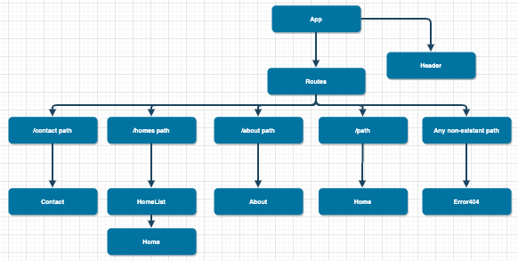

# _First Friday_

#### _February 28th, 2020_

#### By _**Judah Barton**_

## Description

* _8:00 - 9:00 ~ Trying to figure out why create-react-app wont work and nothing will push to github_
* _9:00 - 9:30 ~ Working on treehouse react course to help solidify my knowledge before starting this project_
* _9:30 - 11:30 ~ Met with Owner about what he would like and how he would like it layed out and started to draw it out with him_
* _11:30 - 12:30 ~ Fix my computers problem and Create project and push initial status to git hub._
* _12:30 - 1:30 ~ Lunch_
* _1:30 - 2:00 ~ update files and delete ones that are not needed to my master_
* _2:00 - 2:30 ~ Continue working on my basic setup for my project_
* _2:30 - 3:00 ~ Continue working on my basic setup for my project_
* _3:00 - 5:00 ~ I hit a bump with me design so I need to take it by the owner and finalize some things. So for the last 2 hours I researched the google maps api as well as making api calls and some of the better ways of doing things like routing and cool things I could bring in to it like when you scroll it builds a house in the background. I also have been mapping out what the website will look like._
